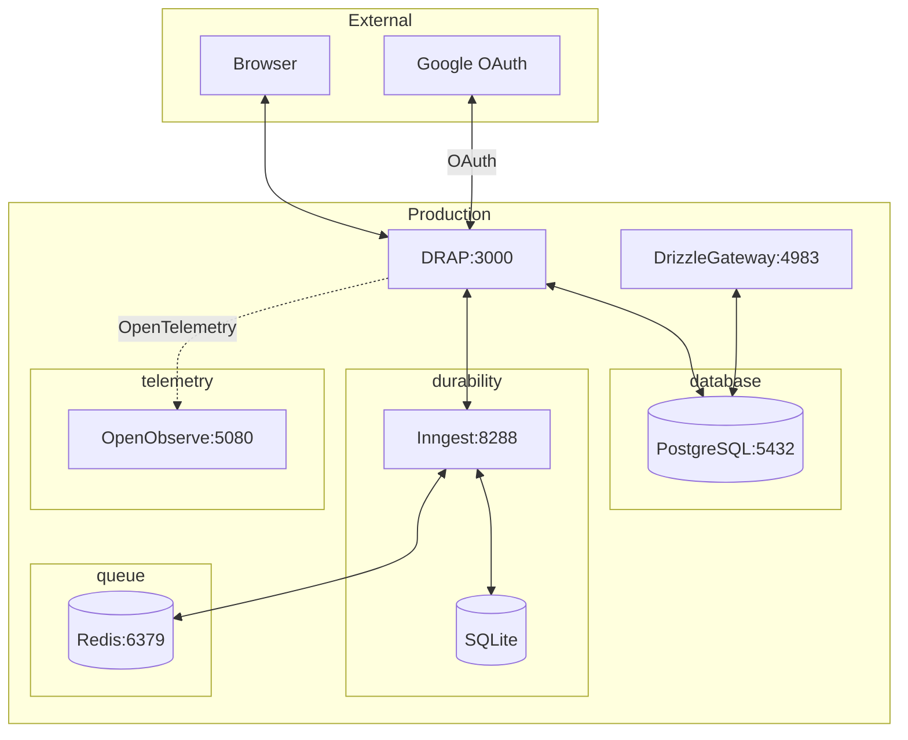
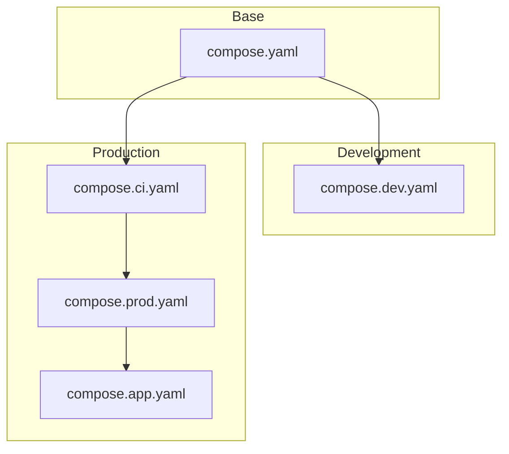

# DRAP: Draft Ranking Automated Processor

Welcome to DRAP: the Draft Ranking Automated Processor for the [University of the Philippines] [Diliman] - [Department of Computer Science]'s yearly draft of research lab assignments. In a nutshell, this web application automates the mechanics of the draft:

[University of the Philippines]: https://up.edu.ph/
[Diliman]: https://upd.edu.ph/
[Department of Computer Science]: https://dcs.upd.edu.ph/

1. All participating students register for the draft by providing their full name, email, student number, and lab rankings (ordered by preference) to the draft administrators.
1. When a draft is created, the active labs' global quotas are captured as per-draft initial quota snapshots.
1. The regular draft process begins. For each round in the draft:
   1. Draft administrators notify (typically via email) the lab heads about all of the students that have chosen their respective research lab as the first choice.
   1. Each lab selects a subset (i.e., possibly none, some, or all) of these first-choice students to accept them into the lab. After this point, the selected students are considered to be "drafted" and are thus no longer part of the next rounds.
   1. The next round begins when all of the labs have submitted their preferences. This time around, the second-choice preferences of the remaining students are evaluated (and so on).
1. Should there be students remaining by the end of the regular draft process, the lottery round begins.
1. Before the randomization stage, draft administrators first negotiate with participating labs (that have remaining slots) to check if any of the labs would like to accept some of the remaining students immediately.
1. During lottery, administrators adjust per-draft lottery quota snapshots to match remaining students exactly.
1. After manual negotiation and intervention, the remaining students are shuffled and assigned to participating labs in a round-robin fashion using the draft's lottery snapshots.
1. The draft concludes when all registered participants have been assigned to a lab.

## Development



### Server Environment Variables

At runtime, the server requires the following environment variables to be present.

| **Variable**                 | **Description**                                                  |
| ---------------------------- | ---------------------------------------------------------------- |
| `ORIGIN`                     | Server origin (e.g., `https://drap.dcs.upd.edu.ph`).             |
| `PUBLIC_ORIGIN`              | Public origin for meta tags (same as `ORIGIN`).                  |
| `GOOGLE_OAUTH_CLIENT_ID`     | OAuth 2.0 credentials retrieved from the [Google Cloud Console]. |
| `GOOGLE_OAUTH_CLIENT_SECRET` | OAuth 2.0 credentials retrieved from the [Google Cloud Console]. |
| `INNGEST_EVENT_KEY`          | Inngest event signing key. Required only in production.          |
| `INNGEST_SIGNING_KEY`        | Inngest webhook signing key. Required only in production.        |
| `POSTGRES_URL`               | The connection string to the PostgreSQL instance.                |
| `DRAP_ENABLE_EMAILS`         | Enable real email sending. Disabled by default.                  |

[Google Cloud Console]: https://console.cloud.google.com/

> [!IMPORTANT]
> The OAuth redirect URI is computed as `${ORIGIN}/dashboard/oauth/callback`.

The following variables are optional in development, but _highly_ recommended in the production environment for [OpenTelemetry](#opentelemetry-instrumentation) integration. The standard environment variables are supported, such as (but not limited to):

| **Name**                      | **Description**                                                                         | **Recommended**                                                |
| ----------------------------- | --------------------------------------------------------------------------------------- | -------------------------------------------------------------- |
| `OTEL_EXPORTER_OTLP_ENDPOINT` | The base OTLP endpoint URL for exporting logs, metrics, and traces.                     | `http://localhost:5080/api/default`                            |
| `OTEL_EXPORTER_OTLP_HEADERS`  | Extra percent-encoded HTTP headers used for exporting telemetry (e.g., authentication). | `Authorization=Basic%20YWRtaW5AZXhhbXBsZS5jb206cGFzc3dvcmQ%3D` |
| `OTEL_EXPORTER_OTLP_PROTOCOL` | The underlying exporter protocol (e.g., JSON, Protobufs, gRPC, etc.).                   | `http/protobuf`                                                |

> [!NOTE]
> The "recommended" values are only applicable to the development environment with OpenObserve running in the background. See the [`compose.yaml`] for more details on the OpenObserve configuration.

[`compose.yaml`]: ./compose.yaml

### Setting up the Codebase

```bash
# Install dependencies.
pnpm install

# Check formatting.
pnpm fmt

# Apply formatting auto-fix.
pnpm fmt:fix
```

### Database Commands

```bash
# Generate Drizzle migrations.
pnpm db:generate

# Apply migrations.
pnpm db:migrate

# Open Drizzle Studio UI.
pnpm db:studio
```

> [!IMPORTANT]
> You must run `pnpm db:migrate` on a fresh database in order to initialize the tables.

### Linting the Codebase

```bash
# Check linting rules.
pnpm lint:eslint
pnpm lint:svelte

# Perform all lints in parallel.
pnpm lint
```

### Docker Compose Files

The project uses layered Docker Compose files for different environments.



| Command            | Files                               | Services                                      |
| ------------------ | ----------------------------------- | --------------------------------------------- |
| `pnpm docker:dev`  | `compose.yaml` + `compose.dev.yaml` | `postgres` (dev), `inngest` (dev), `o2` (dev) |
| `pnpm docker:ci`   | `compose.yaml` + `compose.ci.yaml`  | `postgres` (prod), `inngest` (prod), `redis`  |
| `pnpm docker:prod` | ... + `compose.prod.yaml`           | CI services + `o2` (prod), `drizzle-gateway`  |
| `pnpm docker:app`  | ... + `compose.app.yaml`            | prod services + app                           |

> [!NOTE]
> Docker BuildKit is required to build the local services used during development. In most platforms, Docker Desktop bundles the core Docker Engine with Docker BuildKit. For others (e.g., Arch Linux), a separate `docker-buildx`-like package must be installed.
>
> This requirement is due to the fact that the [custom PostgreSQL image](./docker/postgres/Dockerfile#L9) uses the `TARGETARCH` build argument, which is typically automatically populated by Docker BuildKit.

### Running the Development Server

```bash
# Run dev services (compose.yaml + compose.dev.yaml):
# postgres, inngest (dev mode), o2
pnpm docker:dev

# Run the Vite dev server for SvelteKit.
pnpm dev
```

### Running the Production Server

```bash
# Build the main web application (SvelteKit).
pnpm build

# Run the Vite preview server for SvelteKit.
pnpm preview

# Alternatively, run the Node.js script directly.
node --env-file=.env build/index.js
```

```bash
# Or, spin up CI services (compose.yaml + compose.ci.yaml):
# postgres, inngest (prod mode), redis
pnpm docker:ci
```

```bash
# Or, spin up production internal services (+ compose.prod.yaml):
# CI services + o2, drizzle-gateway
pnpm docker:prod
```

```bash
# Or, spin up full production environment (+ compose.app.yaml):
# prod services + app
pnpm docker:app
```

### Local Telemetry with OpenObserve

To enable full observability in local development:

1. Start the local services (including OpenObserve):
   ```bash
   pnpm docker:dev
   ```
2. Export the OTEL environment variables before running the dev server:
   ```bash
   export OTEL_EXPORTER_OTLP_ENDPOINT='http://localhost:5080/api/default'
   export OTEL_EXPORTER_OTLP_HEADERS='Authorization=Basic%20YWRtaW5AZXhhbXBsZS5jb206cGFzc3dvcmQ%3D'
   export OTEL_EXPORTER_OTLP_PROTOCOL='http/protobuf'
   pnpm dev
   ```
3. View traces and logs at `http://localhost:5080`.

### Running the End-to-End Tests with Playwright

The Playwright configuration runs `pnpm preview` on port `4173` in production mode by default. A single end-to-end test features a single full draft round.

```bash
# Ensure development-only services are spun up. We _can_ use the production setup,
# but that requires a little bit more configuration. This is done in CI, but not
# necessary for local development.
pnpm docker:dev
```

```nu
# Nushell: loads local production overrides and runs tests in one scope.
do {
  open .env.production.local | from toml | load-env;
  pnpm build;
  pnpm test:playwright;
}
```

```bash
# Bash: loads local production overrides and runs tests in one scope.
set -a && source .env.production.local && set +a
pnpm build
pnpm test:playwright
```

## Acknowledgements

The DRAP project, licensed under the [GNU Affero General Public License v3], was originally developed by [Sebastian Luis S. Ortiz][BastiDood], [Victor Edwin E. Reyes][VeeIsForVanana], and [Ehren A. Castillo][ehrelevant] as a service project under the [UP Center for Student Innovations]. The DRAP [logo](./static/favicon.ico) and [banner](./src/lib/banner.png) were originally designed and created by [Angelica Julianne A. Raborar][Anjellyrika].

[BastiDood]: https://github.com/BastiDood
[VeeIsForVanana]: https://github.com/VeeIsForVictor
[ehrelevant]: https://github.com/ehrelevant
[Anjellyrika]: https://github.com/Anjellyrika
[UP Center for Student Innovations]: https://up-csi.org/
[GNU Affero General Public License v3]: ./LICENSE
