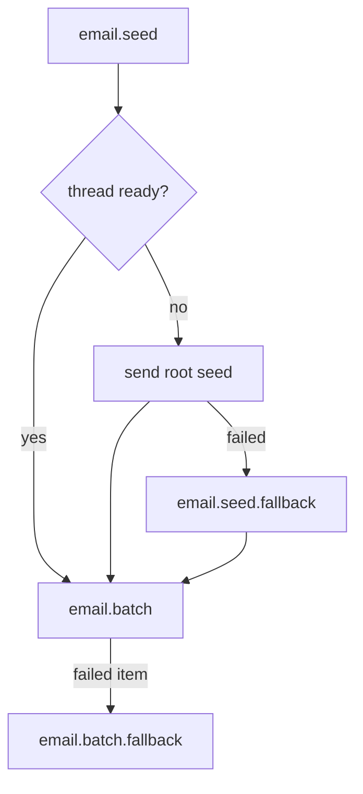

# Email Function Protocol

The email feature owns Gmail thread coordination for outbound notifications.

- `seed` is the only stage that may create missing `email_thread` rows.
- `seed` locks each local thread key before checking `gmailThreadId`.
- `batch` assumes `gmailThreadId` already exists and only sends threaded messages.
- Email subjects must be invariant for every message under the same local thread key. Gmail threading requires matching subjects, so do not include fields outside the key, such as `labId` or create/update mode, in a threaded subject.
- `seed.fallback` may initialize a missing Gmail thread for one seed group.
- `batch.fallback` must not initialize threads; it only recovers ready-thread sends.
- Preserve generated Gmail message UUIDs when forwarding between stages.
- Append `gmailMessageIds` once per local thread key, in envelope order.
