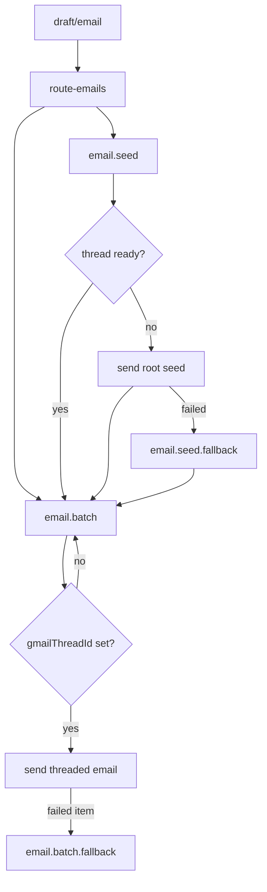

# Email Function Protocol

The email feature owns Gmail thread coordination for outbound notifications.



- Public email events use `draft/email`; their payload `name` values must match `schema.InngestEventName` exactly: `round-started`, `round-submitted`, `lottery-intervened`, `draft-concluded`, `draft-finalization`, or `user-assigned`.
- `route` is the only stage that groups public email events by local Gmail thread key and creates or locks missing `email.gmail_thread` rows.
- `route` sends `email.seed` when `gmailThreadId` is still `null`, using the first grouped email as the root seed and the rest as followers.
- `route` sends `email.batch` immediately when `gmailThreadId` already exists.
- `seed` sends only root seed messages and may initialize a missing Gmail thread by persisting `gmailThreadId` and the root message ID header.
- `seed` must forward ready followers as `email.batch` after the thread is initialized.
- `batch` must not initialize threads; it only sends messages into an existing Gmail thread.
- `batch` treats `gmailThreadId === null` as a blocked follower send. It should reschedule `email.batch` with an exponential back-off by setting the outgoing event payload `ts` option, not by sleeping inside the function.
- Email subjects must be invariant for every message under the same local thread key. Gmail threading requires matching subjects, so do not include fields outside the key, such as `labId` or create/update mode, in a threaded subject.
- `seed.fallback` may initialize a missing Gmail thread for one seed group.
- `batch.fallback` must not initialize threads; it only recovers ready-thread sends and must reschedule blocked sends with the same back-off rule as `batch`.
- Preserve Gmail message ID headers when forwarding or persisting between stages.
- Append `gmailMessageIds` once per local thread row, in send-result order.

## Blocked Thread Back-Off

Use short per-attempt exponential back-off for blocked batch sends where the row exists but `gmailThreadId` is still `null`. This retry only waits for the seed send running elsewhere to persist the Gmail thread ID.

```ts
const delayMs = Math.min(5_000 * 2 ** attempt, 60_000);
```

- Attempt `0` delays by 5 seconds, then 10 seconds, 20 seconds, 40 seconds, and so on.
- Cap the delay at 1 minute.
- Apply the delay by creating the follow-up event with `EmailBatchEvent.create(data, { ts: Date.now() + delayMs })`.
- Keep the retry budget finite; the current blocked-thread retry budget is 8 attempts.
