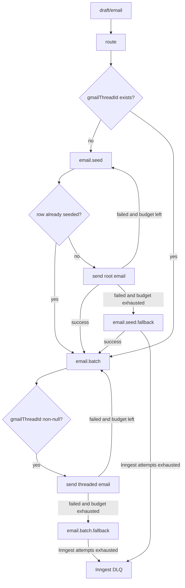

# Email Function Protocol

The email feature owns Gmail thread coordination for outbound notifications.

## Public Event Contract

Public email events use `draft/email`. Their payload `name` values must match `schema.InngestEventName` exactly: `round-started`, `round-submitted`, `lottery-intervened`, `draft-concluded`, `draft-finalization`, or `user-assigned`.

Email subjects must be invariant for every message under the same local thread key. Gmail threading requires matching subjects, so do not include fields outside the key, such as `labId` or create/update mode, in a threaded subject.

## Route

`route` is the only public entrypoint for outbound email events. It groups events by the local Gmail thread key and upserts `email.gmail_thread` rows before dispatching any follow-up events.

The upsert must preserve existing rows by using the logical key as the conflict target with `ON CONFLICT DO NOTHING`. Inserted rows use default values; existing rows keep their current values.

After loading the rows, `route` dispatches:

- `email.seed` when the row has no Gmail API thread ID.
- `email.batch` when the row already has a Gmail API thread ID.

## Seed

`email.seed` fetches all rows it needs inside a transaction using row locks for update.

If a row already has `gmailThreadId`, the seed work is complete. Forward the seed email and followers to `email.batch` and short-circuit the send path.

If a row has no `gmailThreadId`, send the root email without a Gmail API `threadId`, MIME `Message-ID`, `In-Reply-To`, or `References` header. Accumulate failed root sends. Re-enqueue failed roots to `email.seed` until the seed retry budget is exhausted, then forward them to `email.seed.fallback`.

For successful roots, persist the returned Gmail API `threadId` and the Gmail-generated RFC `Message-ID` as one batch update. Once the row is seeded, forward followers to `email.batch` in a separate Inngest step.

## Seed Fallback

`email.seed.fallback` follows the same row-locking and already-seeded short-circuit protocol as `email.seed`, but sends one root request at a time.

On success, persist the Gmail API `threadId` and Gmail-generated RFC `Message-ID`, then forward followers to `email.batch`.

Do not keep separate fallback attempt counters in the event payload. Fallback failures are delegated to normal Inngest retries. When Inngest exhausts those attempts, the event lands in the DLQ and the whole block of seed/follower events is held back for later safe recovery.

## Batch

`email.batch` fetches all referenced Gmail thread rows in bulk. The query projection must assert with `.mapWith` that `gmailThreadId` is non-nullable for rows sent through the batch path.

Send all ready emails in bulk using the row's Gmail API `threadId`. Build `In-Reply-To` from the latest persisted Gmail-generated RFC `Message-ID`, and build `References` from all persisted Gmail-generated RFC `Message-ID` values in order.

Accumulate successes and failures. Persist successful Gmail-generated RFC `Message-ID` values in send-result order. Re-enqueue failed sends to `email.batch` until the batch retry budget is exhausted, then forward them to `email.batch.fallback`.

## Batch Fallback

`email.batch.fallback` performs the same non-null Gmail thread assertions as `email.batch`, but for a single row and one send request.

Fallback failures are delegated to normal Inngest retries. When Inngest exhausts those attempts, the event lands in the DLQ.

## Gmail Thread State

`gmail_thread.gmail_thread_id` is the only seeding sentinel. A `null` value means the local thread has not been initialized with Gmail. A non-null value means future messages must use the batch path.

Do not introduce claim-date or lease columns for root ownership. Concurrency is coordinated by transaction row locks and by re-checking `gmail_thread_id` after queued seed work reaches the database.

Preserve Gmail message ID headers when forwarding or persisting between stages. Append `gmailMessageIds` once per local thread row, in send-result order.
